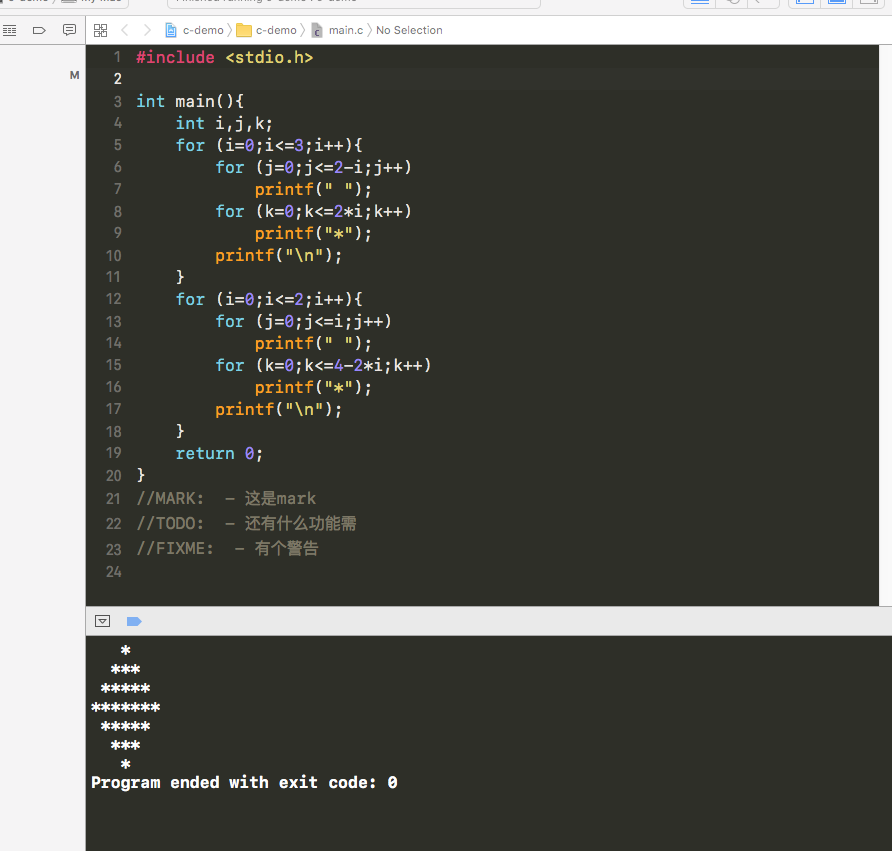

# Xcode-Monokai Xcode >= 7.0

* 终端 $  open /Applications/Xcode.app/Contents/SharedFrameworks/DVTKit.framework/Versions/A/Resources/FontAndColorThemes/  

*  Monokai.xccolortheme 

*  Restart Xcode.

*  Apply Monokai theme.

# 效果

